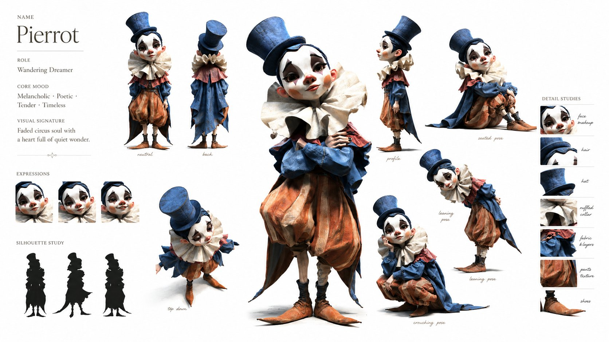
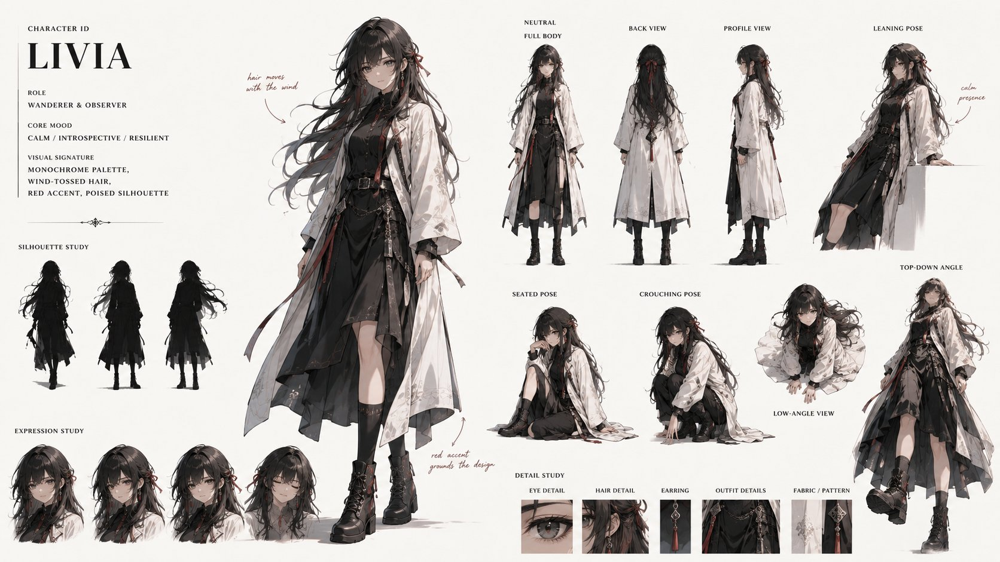

# GPT Image 2 · 角色身份板 Prompt（Character Identity Board）

> 来源：X/Twitter @aimikoda（Kōda）[原文](https://x.com/aimikoda/status/2053860384218444076)
> 工具：GPT Image 2
> 提取时间：2026-05-12
> 来自hueshadow

---

## 完整 Prompt（英文原版，可直接复制使用）

```
Create an artistic 16:9 CHARACTER IDENTITY BOARD.

[SUBJECT]: use reference image

Pure white / soft off-white background.
No environment, no props, no logo, no watermark.

DESIGN DIRECTION:
Do not create a standard character reference sheet.
Create a cinematic identity board that feels like a high-end animation studio character study mixed with an artbook layout.

The layout should be asymmetrical, elegant and visually memorable.
Use large empty space, varied image scale and intentional imbalance.
Avoid grids, blueprint design, catalog layout and repetitive turnaround presentation.

IMPORTANT LAYOUT RULE:
Do not overlap any character images.
Every view must have clear separation and breathing room.
Keep all bodies, portraits, silhouettes and detail studies visually distinct.
No cropped faces, no hidden limbs, no stacked figures, no merged poses.

MAIN COMPOSITION:
Place one large hero full-body view slightly off-center as the visual anchor.

Around it, arrange smaller supporting studies with clean spacing:
neutral full-body view,
back view,
profile view,
seated pose,
leaning pose,
crouching pose,
top-down body angle,
low-angle body angle,
expressive portrait studies.

Each view should feel like a separate clean character study, not a frame from one scene.

IDENTITY LOCK:
Preserve strict identity consistency across all views:
same face,
same facial proportions,
same hairstyle,
same outfit,
same body proportions,
same posture language,
same visual personality.

USEFUL REFERENCE DETAILS:
Make the character readable for future image and video generation:
clear face shape,
clear hair silhouette,
clear outfit silhouette,
clear body shape,
clear hands,
clear posture,
clear expression range.

ARTISTIC SECTIONS:
Include a small silhouette study area with 2-3 simplified black character silhouettes.
Include a small expression study area with subtle emotional variations.
Include a small detail study area showing key visual features of the face, hair and outfit.

TEXT DESIGN:
Add one stylish CHARACTER ID block.
Keep it minimal, bold and art-directed.
Use only:
NAME
ROLE
CORE MOOD
VISUAL SIGNATURE

Use small handwritten-style labels only where helpful.
Subtle editorial arrows and annotation marks are allowed, but keep them minimal and elegant.

STYLE:
minimal,
cinematic,
premium,
artbook-like,
clean,
expressive,
useful for production.

The final image should feel like an artistic character identity board designed to help an AI model understand the character's face, silhouette, outfit, posture and emotional range.
```

---

## 使用说明

### 适用工具
- GPT Image 2（原始创作工具）
- 需上传人物面部参考照片（用于 [SUBJECT]: use reference image）

### 适用场景
- 为角色生成 AI 模型可读的身份参考图，用于后续稳定出图/视频
- 动画工作室风格角色研究 + 设定集排版
- 角色一致性锁定：同一角色多角度、多姿势保持面部/体型/服装统一

### 关键技巧
1. **布局核心**：大尺寸全身主图偏置于画面一侧作为视觉锚点，周边以干净间距排列小尺寸辅助视角
2. **非重叠规则**：每个视角必须独立分离，禁止面部裁切、肢体遮挡、叠放
3. **身份锁**：九个维度锁定角色一致性（面部、比例、发型、服装、体型、姿态语言、视觉个性）
4. **生产可用**：输出服务于后续 AI 图片/视频生成，强调清晰可读的面部轮廓、发型剪影、服装剪影

### 参考效果图



---

## 快捷名

`角色身份板` — 引用此提示词时可直接用此名称
